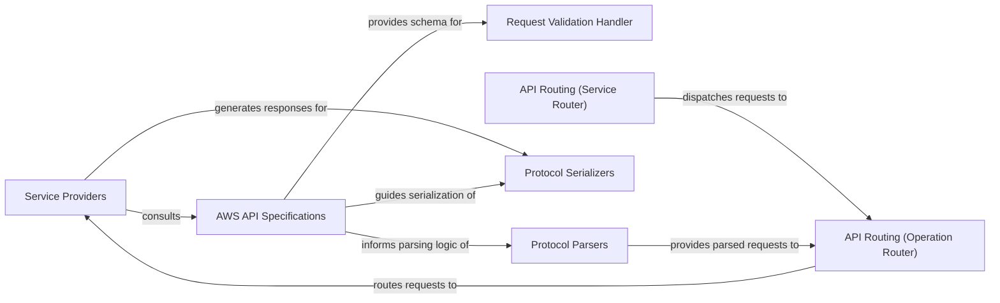

## Component Details

The `AWS Service Emulation & Specs` component is a cornerstone of LocalStack, providing the foundational logic for emulating various AWS APIs and ensuring strict adherence to official AWS API specifications. This comprehensive layer of emulated AWS services offers the core business logic for specific AWS APIs (e.g., S3, Lambda, API Gateway, CloudFormation). It also incorporates and utilizes official AWS API specifications for request validation, contract adherence, and mock response generation.

### Service Providers

These are the central classes responsible for implementing the emulation logic for individual AWS services. Each `provider.py` file within a service's directory (e.g., `localstack.services.s3.provider`, `localstack.services.lambda_.provider`) acts as the entry point for handling API requests for that specific service. They contain the business logic, state management, and interactions with other internal LocalStack components to simulate AWS API behavior.

**Related Classes/Methods**:

- <a href="https://github.com/localstack/localstack/blob/master/localstack-core/localstack/services/apigateway/next_gen/provider.py#L1-L1" target="_blank" rel="noopener noreferrer">`localstack.services.apigateway.next_gen.provider` (1:1)</a>

- <a href="https://github.com/localstack/localstack/blob/master/localstack-core/localstack/services/lambda_/provider.py#L1-L1" target="_blank" rel="noopener noreferrer">`localstack.services.lambda_.provider` (1:1)</a>

- <a href="https://github.com/localstack/localstack/blob/master/localstack-core/localstack/services/s3/provider.py#L1-L1" target="_blank" rel="noopener noreferrer">`localstack.services.s3.provider` (1:1)</a>

- <a href="https://github.com/localstack/localstack/blob/master/localstack-core/localstack/services/cloudformation/provider.py#L1-L1" target="_blank" rel="noopener noreferrer">`localstack.services.cloudformation.provider` (1:1)</a>

- <a href="https://github.com/localstack/localstack/blob/master/localstack-core/localstack/services/sns/provider.py#L1-L1" target="_blank" rel="noopener noreferrer">`localstack.services.sns.provider` (1:1)</a>

- <a href="https://github.com/localstack/localstack/blob/master/localstack-core/localstack/services/sqs/provider.py#L1-L1" target="_blank" rel="noopener noreferrer">`localstack.services.sqs.provider` (1:1)</a>

- <a href="https://github.com/localstack/localstack/blob/master/localstack-core/localstack/services/stepfunctions/provider.py#L1-L1" target="_blank" rel="noopener noreferrer">`localstack.services.stepfunctions.provider` (1:1)</a>

### AWS API Specifications

This module is responsible for loading, parsing, and providing access to the official AWS API specifications (e.g., OpenAPI/Swagger definitions). These specifications are crucial for ensuring that LocalStack's emulated services adhere to the correct request/response contracts, data types, and validation rules defined by AWS. It acts as a central source of truth for AWS API definitions.

**Related Classes/Methods**:

- <a href="https://github.com/localstack/localstack/blob/master/localstack-core/localstack/aws/spec.py#L1-L1" target="_blank" rel="noopener noreferrer">`localstack.aws.spec` (1:1)</a>

### Request Validation Handler

This handler intercepts incoming AWS API requests and validates them against the loaded AWS API specifications. It ensures that the request payload, headers, and parameters conform to the expected format and constraints defined by AWS. This is a critical component for maintaining API contract adherence.

**Related Classes/Methods**:

- <a href="https://github.com/localstack/localstack/blob/master/localstack-core/localstack/aws/handlers/validation.py#L1-L1" target="_blank" rel="noopener noreferrer">`localstack.aws.handlers.validation` (1:1)</a>

### Protocol Parsers

These modules are responsible for parsing incoming AWS API requests from their raw HTTP format into structured data (Python dictionaries) that the service providers can understand. They interpret various AWS protocols (e.g., JSON, Query, REST-XML) and leverage AWS API specifications for correct data type handling.

**Related Classes/Methods**:

- <a href="https://github.com/localstack/localstack/blob/master/localstack-core/localstack/aws/protocol/parser.py#L1-L1" target="_blank" rel="noopener noreferrer">`localstack.aws.protocol.parser` (1:1)</a>

### Protocol Serializers

These modules are responsible for serializing outgoing responses from structured data (Python dictionaries) generated by service providers back into the appropriate AWS protocol format (e.g., JSON, Query, REST-XML) for HTTP responses. They ensure responses adhere to AWS API specifications.

**Related Classes/Methods**:

- <a href="https://github.com/localstack/localstack/blob/master/localstack-core/localstack/aws/protocol/serializer.py#L1-L1" target="_blank" rel="noopener noreferrer">`localstack.aws.protocol.serializer` (1:1)</a>

### API Routing (Operation Router)

This component is responsible for routing incoming AWS API requests to the correct specific API operation within a service. It uses information from the request (e.g., path, method, headers, query parameters) and the service specifications to dispatch the request to the appropriate handler function.

**Related Classes/Methods**:

- <a href="https://github.com/localstack/localstack/blob/master/localstack-core/localstack/aws/protocol/op_router.py#L1-L1" target="_blank" rel="noopener noreferrer">`localstack.aws.protocol.op_router` (1:1)</a>

### API Routing (Service Router)

This component is responsible for identifying which AWS service an incoming HTTP request is targeting. It uses various indicators like host, path, and authentication headers to determine the correct service model, acting as the first layer of routing.

**Related Classes/Methods**:

- <a href="https://github.com/localstack/localstack/blob/master/localstack-core/localstack/aws/protocol/service_router.py#L1-L1" target="_blank" rel="noopener noreferrer">`localstack.aws.protocol.service_router` (1:1)</a>

### [FAQ](https://github.com/CodeBoarding/GeneratedOnBoardings/tree/main?tab=readme-ov-file#faq)