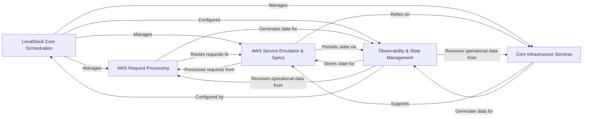

## Component Details

Final Architecture Analysis for `localstack`

### LocalStack Core Orchestration

The central control plane for LocalStack, responsible for application lifecycle management, initialization of core services, and overall orchestration. It includes the command-line interface for user interaction and the runtime engine that manages the entire LocalStack environment.

**Related Classes/Methods**:

- <a href="https://github.com/localstack/localstack/blob/master/localstack-core/localstack/cli/localstack.py#L168-L182" target="_blank" rel="noopener noreferrer">`localstack.cli.localstack` (168:182)</a>

- <a href="https://github.com/localstack/localstack/blob/master/localstack-core/localstack/runtime/main.py#L1-L1" target="_blank" rel="noopener noreferrer">`localstack.runtime.main` (1:1)</a>

- <a href="https://github.com/localstack/localstack/blob/master/localstack-core/localstack/runtime/runtime.py#L1-L1" target="_blank" rel="noopener noreferrer">`localstack.runtime.runtime` (1:1)</a>

### AWS Request Processing

Handles all incoming AWS API requests, including receiving HTTP requests, parsing them according to AWS protocols (JSON, XML, Query), routing them to the appropriate emulated service, and serializing responses back to clients.

**Related Classes/Methods**:

- <a href="https://github.com/localstack/localstack/blob/master/localstack-core/localstack/aws/app.py#L1-L1" target="_blank" rel="noopener noreferrer">`localstack.aws.app` (1:1)</a>

- <a href="https://github.com/localstack/localstack/blob/master/localstack-core/localstack/aws/gateway.py#L1-L1" target="_blank" rel="noopener noreferrer">`localstack.aws.gateway` (1:1)</a>

- <a href="https://github.com/localstack/localstack/blob/master/localstack-core/localstack/aws/protocol/parser.py#L1-L1" target="_blank" rel="noopener noreferrer">`localstack.aws.protocol.parser` (1:1)</a>

- <a href="https://github.com/localstack/localstack/blob/master/localstack-core/localstack/aws/protocol/serializer.py#L1-L1" target="_blank" rel="noopener noreferrer">`localstack.aws.protocol.serializer` (1:1)</a>

### AWS Service Emulation & Specs

A comprehensive layer of emulated AWS services, providing the core business logic for specific AWS APIs (e.g., S3, Lambda, API Gateway, CloudFormation). This component also incorporates and utilizes official AWS API specifications for request validation, contract adherence, and mock response generation.

**Related Classes/Methods**:

- `localstack.services.apigateway.provider` (1:1)

- <a href="https://github.com/localstack/localstack/blob/master/localstack-core/localstack/services/lambda_/provider.py#L1-L1" target="_blank" rel="noopener noreferrer">`localstack.services.lambda_.provider` (1:1)</a>

- <a href="https://github.com/localstack/localstack/blob/master/localstack-core/localstack/services/s3/provider.py#L1-L1" target="_blank" rel="noopener noreferrer">`localstack.services.s3.provider` (1:1)</a>

- <a href="https://github.com/localstack/localstack/blob/master/localstack-core/localstack/services/cloudformation/provider.py#L1-L1" target="_blank" rel="noopener noreferrer">`localstack.services.cloudformation.provider` (1:1)</a>

- <a href="https://github.com/localstack/localstack/blob/master/localstack-core/localstack/services/sns/provider.py#L1-L1" target="_blank" rel="noopener noreferrer">`localstack.services.sns.provider` (1:1)</a>

- <a href="https://github.com/localstack/localstack/blob/master/localstack-core/localstack/services/sqs/provider.py#L1-L1" target="_blank" rel="noopener noreferrer">`localstack.services.sqs.provider` (1:1)</a>

- <a href="https://github.com/localstack/localstack/blob/master/localstack-core/localstack/services/stepfunctions/provider.py#L1-L1" target="_blank" rel="noopener noreferrer">`localstack.services.stepfunctions.provider` (1:1)</a>

- <a href="https://github.com/localstack/localstack/blob/master/localstack-core/localstack/aws/spec.py#L1-L1" target="_blank" rel="noopener noreferrer">`localstack.aws.spec` (1:1)</a>

### Core Infrastructure Services

Provides foundational utilities and integrations necessary for LocalStack's operation. This includes managing internal and external service connections (e.g., DNS resolution, client factories), interacting with container runtimes like Docker, and handling the download and lifecycle of external software dependencies.

**Related Classes/Methods**:

- <a href="https://github.com/localstack/localstack/blob/master/localstack-core/localstack/aws/connect.py#L1-L1" target="_blank" rel="noopener noreferrer">`localstack.aws.connect` (1:1)</a>

- <a href="https://github.com/localstack/localstack/blob/master/localstack-core/localstack/dns/server.py#L1-L1" target="_blank" rel="noopener noreferrer">`localstack.dns.server` (1:1)</a>

- <a href="https://github.com/localstack/localstack/blob/master/localstack-core/localstack/utils/docker_utils.py#L1-L1" target="_blank" rel="noopener noreferrer">`localstack.utils.docker_utils` (1:1)</a>

- <a href="https://github.com/localstack/localstack/blob/master/localstack-core/localstack/utils/container_utils/container_client.py#L1-L1" target="_blank" rel="noopener noreferrer">`localstack.utils.container_utils.container_client` (1:1)</a>

- <a href="https://github.com/localstack/localstack/blob/master/localstack-core/localstack/packages/api.py#L1-L1" target="_blank" rel="noopener noreferrer">`localstack.packages.api` (1:1)</a>

- <a href="https://github.com/localstack/localstack/blob/master/localstack-core/localstack/packages/core.py#L1-L1" target="_blank" rel="noopener noreferrer">`localstack.packages.core` (1:1)</a>

### Observability & State Management

Manages the persistence and retrieval of LocalStack's internal state for all emulated services, enabling features like state snapshots and consistent behavior. It also provides a centralized logging infrastructure and collects usage/performance metrics for monitoring and debugging across the entire system.

**Related Classes/Methods**:

- <a href="https://github.com/localstack/localstack/blob/master/localstack-core/localstack/state/core.py#L1-L1" target="_blank" rel="noopener noreferrer">`localstack.state.core` (1:1)</a>

- <a href="https://github.com/localstack/localstack/blob/master/localstack-core/localstack/state/pickle.py#L1-L1" target="_blank" rel="noopener noreferrer">`localstack.state.pickle` (1:1)</a>

- <a href="https://github.com/localstack/localstack/blob/master/localstack-core/localstack/logging/setup.py#L1-L1" target="_blank" rel="noopener noreferrer">`localstack.logging.setup` (1:1)</a>

- <a href="https://github.com/localstack/localstack/blob/master/localstack-core/localstack/logging/format.py#L1-L1" target="_blank" rel="noopener noreferrer">`localstack.logging.format` (1:1)</a>

- <a href="https://github.com/localstack/localstack/blob/master/localstack-core/localstack/runtime/analytics.py#L1-L1" target="_blank" rel="noopener noreferrer">`localstack.runtime.analytics` (1:1)</a>

### [FAQ](https://github.com/CodeBoarding/GeneratedOnBoardings/tree/main?tab=readme-ov-file#faq)