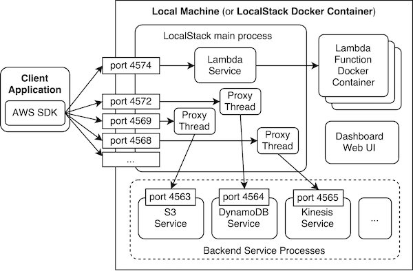

# Developer Guide

This document contains a few essential instructions for developing new features and bug fixes for *LocalStack*.

## General Application Architecture

The coarse-grained system architecture is illustrated in the figure below. The LocalStack components are
either installed on the local machine, or the entire application runs in a Docker container. The application
exposes a set of external network ports (see defaults in
[constants.py](https://github.com/localstack/localstack/blob/master/localstack/constants.py)).
Client applications can use the standard AWS SDKs to connect to LocalStack; most SDKs have a configuration
option to configure the endpoint URLs of the target services (e.g., configure `http://localhost:4572`
as endpoint URL to connect to local DynamoDB).



To handle incoming requests on the external network ports, LocalStack uses proxy threads which inspect
the incoming request message, forward the requests to corresponding backend service processes, and
perform any additional processing. The additional processing is required because some of the backend
services only provide the basic "CRUD" functionality for maintaining API state, and LocalStack
provides integrations on top of these services. This makes the backend services easily replaceable
with best-of-breed implementations.


## Proxy Interceptors

For the basic "CRUD" functionality of most services we're using a mock implementation (e.g., based on `moto`) in the background, and *LocalStack* adds a bunch of integrations on top of these services. We start up an HTTP proxy which intercepts all invocations and forwards requests to the backend. This allows us to add extended functionality without having to change the backend service.

The figure below illustrates the proxy mechanism and ports for the API Gateway service. (The default ports can be found in https://github.com/localstack/localstack/blob/master/localstack/constants.py )

```
 --------      -------------      -------------
| Client | -> |    Proxy    | -> |   Backend   |
|        |    | (port 4567) |    | (port 4566) |
 --------      -------------      -------------
```

The proxy follows a simple protocol by implementing 2 methods: `forward_request` which is called *before* a request is forwarded to the backend, and `return_response` which is called *after* a response has been received from the backend: https://github.com/localstack/localstack/blob/master/localstack/services/generic_proxy.py

The proxy implementation for API Gateway can be found here: https://github.com/localstack/localstack/blob/master/localstack/services/apigateway/apigateway_listener.py#L81

## Patching/Releasing a Third-Party Libraries

To enable a fast release cycle of *LocalStack*, we're using forked versions of various third-party libraries. For example, we have a forked version of `moto` which is published as a separate `moto-ext` pip package: https://github.com/whummer/moto/tree/localstack-fixes . If you decide to extend `moto`, you can either raise a PR against that repo, or against the main repo `spulec/moto` (then we need to take care of cross-merging and releasing new versions).
