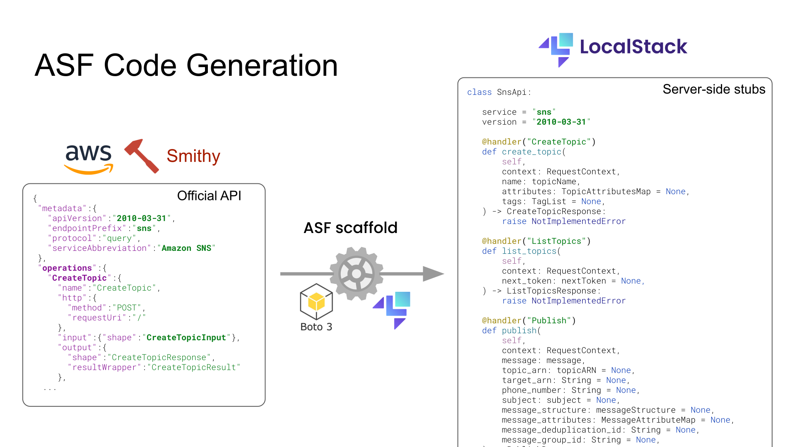
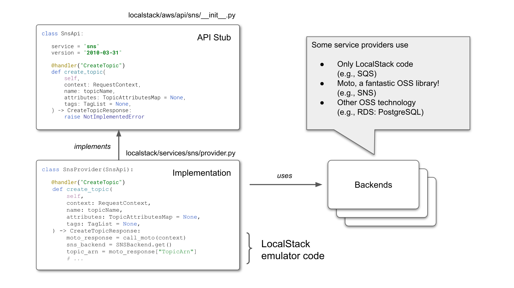
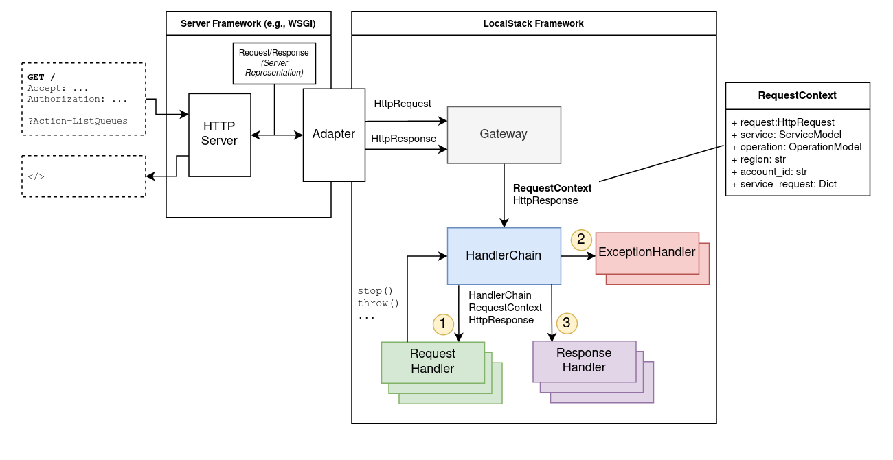
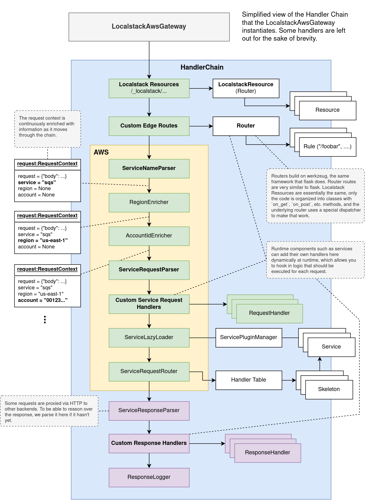

# LocalStack Concepts

When you first start working on LocalStack, you will most likely start working on AWS providers, either fixing bugs or adding features. In that case, you probably care mostly about [Services](#service), and, depending on the service and how it interacts with the [Gateway](#gateway), also **custom request handlers** and edge **routes**.

If you are adding new service providers, then you’ll want to know how [Plugins](#plugins) work, and how to expose a service provider as a [service plugin](#service-plugin). This guide will give you a comprehensive overview about various core architectural concepts of LocalStack.

## AWS Server Framework (ASF)

AWS is essentially a Remote Procedure Call (RPC) system, and ASF is our server-side implementation of that system. The principal components of which are:

-   Service specifications
-   Stub generation
-   Remote objects (service implementations)
-   Marshalling
-   Skeleton

### Service specifications

AWS developed a specification language, [Smithy](https://awslabs.github.io/smithy/), which they use internally to define their APIs in a declarative way. They use these specs to generate client SDKs and client documentation. All these specifications are available, among other repositories, in the [botocore repository](https://github.com/boto/botocore/tree/develop/botocore/data). Botocore are the internals of the AWS Python SDK, which allows ASF to interpret and operate on the service specifications. Take a look at an example, [the `Invoke` operation of the `lambda` API](https://github.com/boto/botocore/blob/474e7a23d0fd178790579638cec9123d7e92d10b/botocore/data/lambda/2015-03-31/service-2.json#L564-L573):

```bash 
	"Invoke":{
    "name":"Invoke",
    "http":{
      "method":"POST",
      "requestUri":"/2015-03-31/functions/{FunctionName}/invocations"
    },
    "input":{"shape":"InvocationRequest"},
    "output":{"shape":"InvocationResponse"},
    "errors":[
      {"shape":"ServiceException"},
    ...
```

### Scaffold - Generating AWS API stubs

We use these specifications to generate server-side API stubs using our scaffold script. The stubs comprise Python representations of _Shapes_ (type definitions), and an `<Service>Api` class that contains all the operations as function definitions. Notice the `@handler` decorator, which binds the function to the particular AWS operation. This is how we know where to dispatch the request to.



You can try it using this command in the LocalStack repository:

```bash
python -m localstack.aws.scaffold generate <service> --save [--doc]
```

### Service providers

A service provider is an implementation of an AWS service API. Service providers are the remote object in the RPC terminology. You will find the modern ASF provider implementations in `localstack/services/<service>/provider.py`.

### Marshalling

A server-side protocol implementation requires a marshaller (a parser for incoming requests, and a serializer for outgoing responses).

- Our [protocol parser](https://github.com/localstack/localstack/blob/master/localstack/aws/protocol/parser.py) translates AWS HTTP requests into objects that can be used to call the respective function of the service provider.
- Our [protocol serializer](https://github.com/localstack/localstack/blob/master/localstack/aws/protocol/serializer.py) translates response objects coming from service provider functions into HTTP responses.

## Service

Most services are AWS providers, i.e, implementations of AWS APIs. But don’t necessarily have to be.

### Provider

Here’s the anatomy of an AWS service implementation. It implements the API stub generated by the scaffold.



### Stores

All data processed by the providers are retained by in-memory structures called Stores. Think of them as an in-memory database for the providers to store state. Stores are written in a declarative manner similar to how one would write SQLAlchemy models.

Stores support namespacing based on AWS Account ID and Regions, which allows emulation of multi-tenant setups and data isolation between regions, respectively.

LocalStack has a feature called persistence, where the states of all providers are restored when the LocalStack instance is restarted. This is achieved by pickling and unpickling the provider stores.

### `call_moto`

Many LocalStack service providers use [`moto`](https://github.com/spulec/moto) as a backend. Moto is an open-source library that provides mocking for Python tests that use Boto, the Python AWS SDK. We re-use a lot of moto’s internal functionality, which provides mostly CRUD and some basic emulation for AWS services. We often extend services in Moto with additional functionality. Moto plays such a fundamental role for many LocalStack services, that we have introduced our own tooling around it, specifically to make requests directly to moto.

To add functionality on top of `moto`, you can use `call_moto(context: RequestContext)` to forward the given request to `moto`. When used in a service provider `@handler` method, it will dispatch the request to the correct `moto` implementation of the operation, if it exists, and return the parsed AWS response.

The `MotoFallbackDispatcher` generalizes the behavior for an entire API. You can wrap any provider with it, and it will forward any request that returns a `NotImplementedError` to moto instead and hope for the best.

Sometimes we also use `moto` code directly, for example importing and accessing `moto` backend dicts (state storage for services).

## `@patch`

[The patch utility](https://github.com/localstack/localstack/blob/master/localstack/utils/patch.py) enables easy [monkey patching](https://en.wikipedia.org/wiki/Monkey_patch) of external functionality. We often use this to modify internal moto functionality. Sometimes it is easier to patch internals than to wrap the entire API method with the custom functionality.

### Server

[Server](<https://github.com/localstack/localstack/blob/master/localstack/utils/serving.py>) is an abstract class that provides a basis for serving other backends that run in a separate process. For example, our Kinesis implementation uses [kinesis-mock](https://github.com/etspaceman/kinesis-mock/) as a backend that implements the Kinesis AWS API and also emulates its behavior. 

The provider [starts the kinesis-mock binary in a `Server`](https://github.com/localstack/localstack/blob/2e1e8b4e3e98965a7e99cd58ccdeaa6350a2a414/localstack/services/kinesis/kinesis_mock_server.py), and then forwards all incoming requests to it using `forward_request`. This is a similar construct to `call_moto`, only generalized to arbitrary HTTP AWS backends. 

A server is reachable through some URL (not necessarily HTTP), and the abstract class implements the lifecycle of the process (start, stop, is_started, is_running, etc). To create a new server, you only need to overwrite either `do_run`, or `do_start_thread`, with custom logic to start the binary.

There are some existing useful utilities and specializations of `Server` which can be found across the codebase. For example, `DockerContainerServer` spins up a Docker container on a specific port, and `ProxiedDockerContainerServer` adds an additional TCP/HTTP proxy server (running inside the LocalStack container) that tunnels requests to the container.

### External service ports

Some services create additional user-facing resources. For example, the RDS service starts a PostgreSQL server, and the ElastiCache service starts a Redis server, that users then directly connect to. 

These resources are not hidden behind the service API, and need to be exposed through an available network port. This is what the [external service port range](https://docs.localstack.cloud/references/external-ports/) is for. We expose this port range by default in the docker-compose template, or via the CLI.

### Service plugin

A service provider has to be exposed as a service plugin for our code loading framework to pick it up.

## Gateway

The Gateway is a simple interface: `process(Request, Response)`. It receives an HTTP request and a response that it should populate. To that end, the Gateway uses a `HandlerChain` to process the request.

An adapter exposes the gateway as something that can be served by a web server. By default, we use Hypercorn, an ASGI web server, and expose the Gateway as an ASGI app through our WSGI/ASGI bridge.

The gateway creates a `RequestContext` object for each request, which is passed through the handler chain.

All components of our HTTP framework build heavily on the Werkzeug HTTP server library [Werkzeug](https://github.com/pallets/werkzeug/), which makes our app WSGI compatible.



### Handler Chain

The handler chain implements a variant of the [chain-of-responsibility pattern](https://en.wikipedia.org/wiki/Chain-of-responsibility_pattern), not unlike [the javax.servlet API](https://docs.oracle.com/javaee/7/api/javax/servlet/package-summary.html). The handler chain knows about three different handlers: Request Handlers, Response Handlers, and Exception Handlers. Request and response handlers have the same interface, they only differ in how they are invoked by the handler chain.

A handler chain can be _running_, _stopped_ or _terminated_. If a request handler stops the chain using `chain.stop()`, the chain stops invoking the remaining request handlers, and jumps straight to the response handlers. If the chain is _terminated_, then even response handlers are skipped.

If an exception occurs during the execution of a request handler, no other request handlers are executed, and instead the chain calls the exception handlers, and then all response handlers. Exceptions during response handlers are logged, but they do not interrupt the handler chain flow.

### LocalStack AWS Gateway

Here is a figure of the handler chain underlying the `LocalstackAwsGateway`, which every HTTP request to `:4566` goes through.

Some handlers are designed to be extended dynamically at runtime by other services. For example, a service can add HTTP routes to the edge router, which can then process the request differently. OpenSearch, for example, uses this to register HTTP routes to [cluster endpoints](https://docs.localstack.cloud/user-guide/aws/opensearch/#interact-with-the-cluster), that are proxied through `:4566` to the cluster backend.



## Plugins

Plugins provided by [https://github.com/localstack/plux](https://github.com/localstack/plux) are how we load:

-   Service providers
-   Hooks
-   Extensions

Key points to understand are that plugins use [Python entry points, which are part of the PyPA specification](https://packaging.python.org/en/latest/specifications/entry-points/). Entry points are discovered from the code during a build step rather than defined manually (this is the main differentiator of Plux to other code loading tools). In LocalStack, the `make entrypoints` make target does that, which is also part of `make install`.

When you add new hooks or service providers, or any other plugin, make sure to run `make entrypoints`.

When writing plugins, it is important to understand that any code that sits in the same module as the plugin, will be imported when the plugin is _resolved_. That is, _before_ it is loaded. Resolving a plugin simply means discovering the entry points and loading the code the underlying entry point points to. This is why many times you will see imports deferred to the actual loading of the plugin.

## Config

The LocalStack configuration is currently simply a set of well-known environment variables that we parse into python values in `localstack/config.py`. When LocalStack is started via the CLI, we also need to pass those environment variables to the container, which is why we keep [a list of the environment variables we consider to be LocalStack configuration](https://github.com/localstack/localstack/blob/7e3045dcdca255e01c0fbd5dbf0228e500e8f42e/localstack/config.py#L693-L700).

## Hooks

Hooks are functions exposed as plugins that are collected and executed at specific points during the LocalStack lifecycle. This can be both in the runtime (executed in the container) and the CLI (executed on the host).

### **Host/CLI hooks**

These hooks are relevant only to invocations of the CLI. If you use, for example, a docker-compose file to start LocalStack, these are not used.

-   `@hooks.prepare_host` Hooks to prepare the host that's starting LocalStack. Executed on the host when invoking the CLI.
-   `@hooks.onfigure_localstack_container` Hooks to configure the LocalStack container before it starts. Executed on the host when invoking the CLI. This hook receives the `LocalstackContainer` object, which can be used to instrument the `docker run` command that starts LocalStack.

### **Runtime hooks**

-   `@hooks.on_infra_start` Executed when LocalStack runtime components (previously known as _infrastructure_) are started.
-   `@hooks.on_infra_ready` Executed when LocalStack is ready to server HTTP requests.

## Runtime

The components necessary to run the LocalStack server application are collectively referred to as the _runtime_. This includes the Gateway, scheduled worker threads, etc. The runtime is distinct from the CLI, which runs on the host. Currently, there is no clear separation between the two, you will notice this, for example, in the configuration, where some config variables are used for both the CLI and the runtime. Similarly, there is code used by both. Separating the two is an ongoing process.


## Packages and installers

Whenever we rely on certain third party software, we install it using our package installation framework, which consists of packages and installers.

A package defines a specific kind of software we need for certain services, for example [dynamodb-local](https://docs.aws.amazon.com/amazondynamodb/latest/developerguide/DynamoDBLocal.html).
It also encapsulates general information like name, available versions, etc., and manages the access to the actual installer that is used.

The installer manages all installation-related information: the destination, the actual installation routine, etc.
There are various types of installers available as base classes that try to minimize the required effort to install software, depending on what we need to install (executables, jar files, GitHub assets,...).
So before you start reinventing the wheel, please check if there is a suitable class to extend.

Packages and installers can usually be found in `packages.py` in the `localstack.services.<service>` module of the service that requires the dependency.
Dependencies that are required by multiple services are located in `localstack.packages`.

Additionally, there is the _LocalStack Package Manager (LPM)_.
`lpm` is a module located in `localstack.cli` that provides a [Click](https://click.palletsprojects.com/)-powered CLI interface to trigger installations.
It uses the [Plugin mechanism](#plugins) to discover packages.
_LPM_ can be used directly as a module, and if called without a specific command it prints an extensive description of its available commands:

```python
source .venv/bin/activate
python -m localstack.cli.lpm
```

### Versions
As dependencies exist in different versions, we need to reflect this in our process.
Every version of a package needs to be explicitly supported by an installer implementation.
The package needs to manage the different installers for the different versions.
Each installer for a specific version should only have one instance (due to lock handling).
Resources that do not use versions (e.g. because there is only a link to the newest one) generally use `latest` as version name.

### Installation targets
To keep things nice and clean, packages are installed in two locations, `static_libs` and `var_libs`.

`static_libs` is used for packages installed at build time.
When building the docker container, the packages are installed to a folder which will not be overwritten by a host-mounted volume.
The `static_libs` directory should not be modified at container runtime, as it will be reset when the container is recreated.
This is the default target if a package is installed in the aforementioned way via `python -m localstack.cli.lpm install`.

`var_libs` is the main and default location used for packages installed at runtime.
When starting the docker container, a host-volume is mounted at `var_libs`. 
The content of the directory will persist across multiple containers.

### Installation life-cycle
The installer base class provides two methods to manage potentially necessary side tasks for the installation: `_prepare_installation` and `_post_process`.
These methods simply `pass` by default and need to be overwritten should they be needed.

### Package discovery
For LPM to be able to discover a package, we expose it via the package plugin mechanism.
This is usually done by writing a function in `plugins.py` that loads a package instance by using the `@package` decorator.

### `lpm` commands
The available `lpm` commands are:

- `python -m localstack.cli.lpm list`
- `python -m localstack.cli.lpm install [OPTIONS] PACKAGE...`

For help with the specific commands, use `python -m localstack.cli.lpm <command> --help`.

## Utilities

The codebase contains a wealth of utility functions for various common tasks like handling strings, JSON/XML, threads/processes, collections, date/time conversions, and much more.

The utilities are grouped into multiple util modules inside the [localstack.utils](<https://github.com/localstack/localstack/tree/master/localstack/utils>) package. Some of the most commonly used utils modules include:

-   `.files` - file handling utilities (e.g., `load_file`, `save_file`, or `mkdir`)
-   `.json` - handle JSON content (e.g., `json_safe`, or `canonical_json`)
-   `.net` - network ports (e.g., `wait_for_port_open`, or `is_ip_address`)
-   `.run` - run external commands (e.g., `run`, or `ShellCommandThread`)
-   `.strings` - string/bytes manipulation (e.g., `to_str`, `to_bytes`, or `short_uid`)
-   `.sync` - concurrency synchronization (e.g., `poll_condition`, or `retry`)
-   `.threads` - manage threads and processes (e.g., `FuncThread`)
